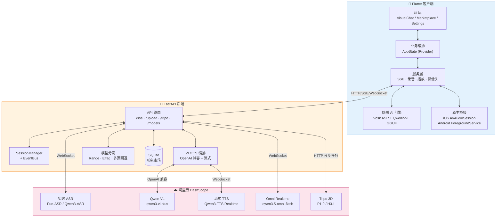
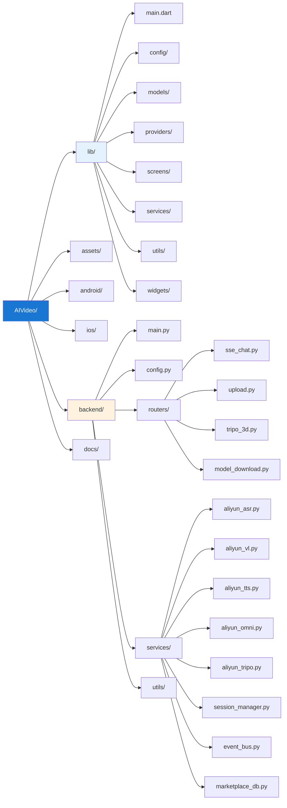

<div align="center">

# 🌟 AI小芒 (AI Xiaomang)

### 让手机摄像头与麦克风，成为可对话的「第二双眼睛」

**实时视觉 · 语音对话 · 3D 形象 · 离线/云端双模**

[](https://flutter.dev)
[](https://dart.dev)
[](https://fastapi.tiangolo.com)
[](https://python.org)
[](#-环境要求)
[](#-原创声明)
[](#-快速开始)
[](https://dashscope.aliyun.com)

一款基于 **Flutter + FastAPI** 的 AI 视觉语音对话 App，集成**阿里云 DashScope**（ASR / VL / TTS / Omni / Tripo 3D）与**本地端侧模型**（Vosk + Qwen2-VL GGUF），支持**离线 0 费用**与**云端增强**两种运行模式，可一键生成 3D 数字形象。

> 🎬 **演示视频**：[AI 小芒功能演示.MOV](https://pan.baidu.com/s/1S4PDVxpVHCAYMJ-Cd8qMaQ?pwd=8888)（提取码 `8888`）
>
> ⚠️ **离线模式（Vosk + Qwen2-VL-2B）正在完善中**，目前主推 **Omni 云端增强**模式。

</div>

---

## 📑 目录

- [🌟 项目简介](#-项目简介)
- [✨ 核心特性](#-核心特性)
- [🎯 三种运行模式](#-三种运行模式)
- [🏗️ 技术架构](#️-技术架构)
- [🛠️ 技术栈一览](#️-技术栈一览)
- [📋 完整依赖列表](#-完整依赖列表)
- [🔧 环境要求](#-环境要求)
- [🚀 快速开始](#-快速开始)
- [📁 项目结构](#-项目结构)
- [🔐 权限说明](#-权限说明)
- [🧠 原创声明与第三方依赖清单](#-原创声明与第三方依赖清单)
- [📝 开发规范](#-开发规范)
- [📚 交付文档](#-交付文档)
- [🙏 致谢](#-致谢)

---

## 🌟 项目简介

> **AI 小芒** 是一款「看得见、听得懂、会说话」的 AI 助手 App。
> 把摄像头对准任何物体、场景或文字，按住麦克风提问，AI 会结合**实时画面 + 语音**给出**语音 + 文字**的回答。

- 📷 **所见即所答**：摄像头抽帧 → 多模态大模型 → 流式 TTS 播报
- 🎙️ **两种交互模式**：VAD（自动检测说话结束）/ Manual（按住说话）
- 🤖 **数字形象生成**：文生 / 单图 / 多图 → 阿里云 Tripo 3D，1 分钟拥有专属形象
- 🛒 **形象市场**：可发布 / 检索 / 收藏他人创建的 3D 形象
- 💰 **离线 0 费用**：本地 Vosk ASR + Qwen2-VL-2B GGUF + FlutterTts，零云端开销

---

## ✨ 核心特性

<table>
  <tr>
    <td align="center" width="33%">🧠<br><b>多模态实时理解</b><br>摄像头 + 麦克风联合推理</td>
    <td align="center" width="33%">⚡<br><b>流式低延迟</b><br>SSE 文本 + 音频同步回传</td>
    <td align="center" width="33%">📴<br><b>离线端侧</b><br>零云端费用 + 网络降级</td>
  </tr>
  <tr>
    <td align="center">🎨<br><b>3D 形象生成</b><br>Tripo 文生 / 单图 / 多图</td>
    <td align="center">🛒<br><b>形象市场</b><br>公开 / 不公开 / 私密可见性</td>
    <td align="center">🔄<br><b>双模自动降级</b><br>云端失败自动回退离线</td>
  </tr>
  <tr>
    <td align="center">🎙️<br><b>硬件级 AEC/AGC</b><br>iOS voiceChat + Android 前台保活</td>
    <td align="center">🎭<br><b>AI 状态动效</b><br>2D / 3D 自适应 + 音量联动</td>
    <td align="center">💾<br><b>运行时下载模型</b><br>避免 iOS 包体积限制</td>
  </tr>
</table>

---

## 🎯 三种运行模式

| 模式 | 能力栈 | 协议 | 费用 | 适用场景 |
|------|--------|------|------|----------|
| **🟢 离线本地** | Vosk 中文端侧 ASR + Qwen2-VL-2B GGUF 视觉理解 + FlutterTts 本地播报 | 端侧 | **¥0** | 隐私敏感 / 弱网 / 演示 |
| **🔵 云端 VL+TTS** | 阿里云实时 ASR + 通义千问 VL + 流式 TTS | HTTP+SSE | 按量付费 | 通用云端推理 |
| **🟣 云端 Omni** ⭐ | Qwen-Omni-Realtime 一体化音视频 | WebSocket | 按量付费 | **推荐**：一体化、低延迟 |

> ⭐ **主推模式**：`qwen3.5-omni-flash-realtime` 一体化音视频，端到端低延迟、表情/语气更自然。

---

## 🏗️ 技术架构



**核心数据流**：

1. **上行**：`摄像头抽帧 (BGRA→JPG85)` + `麦克风分片 (PCM 16kHz)` → 后端 `/upload`
2. **VL+TTS 模式**：后端 `/sse/chat` → DashScope VL 流式文本 → DashScope TTS 流式 PCM → SSE 回传前端
3. **Omni 模式**：WebSocket 双向流（音视频双向）→ DashScope Omni → 事件总线推送
4. **离线模式**：Vosk 流式 ASR → 文本 → llama.cpp Qwen2-VL 推理 → FlutterTts 本地播报

---

## 🛠️ 技术栈一览

| 分类 | 技术 |
|------|------|
| **跨端框架** | Flutter 3.22+ / Dart 3.2+ |
| **状态管理** | Provider 6.x（`ChangeNotifier` 全局编排） |
| **音频播放** | flutter_soloud（SoLoud C++ + AVAudioEngine，gapless PCM 24kHz） |
| **音频录制** | record 6.x（PCM 16kHz mono，200ms 分片） |
| **本地 TTS** | flutter_tts（中文离线播报） |
| **离线 ASR** | vosk_flutter_service（社区活跃分支，iOS 兼容） |
| **离线 VL** | llama_cpp_dart（Qwen2-VL-2B-Instruct Q4_K_M GGUF） |
| **网络** | http（SSE + HTTP 上行）、`connectivity_plus`（网络探测） |
| **3D 渲染** | model_viewer_plus（WebView + model-viewer.js） |
| **图像处理** | image（解码 / 缩放 / JPG 编码） |
| **持久化** | shared_preferences |
| **后端框架** | FastAPI 0.110+ / Uvicorn |
| **SSE** | sse-starlette |
| **WebSocket** | websockets（阿里云 DashScope 客户端） |
| **HTTP 客户端** | httpx（阿里云 OpenAI 兼容 / Tripo 异步任务） |
| **ORM** | SQLModel（SQLite，3D 形象市场） |
| **数据校验** | Pydantic v2 |
| **阿里云** | DashScope（ASR / VL / TTS / Omni）+ Tripo 3D |
| **原生** | iOS AVAudioSession voiceChat / Android ForegroundService + WakeLock |

---

## 📋 完整依赖列表

### 📱 Flutter 客户端（`pubspec.yaml`）

| 依赖 | 版本 | 用途 |
|------|------|------|
| `flutter` | SDK ≥3.22.0 | Flutter SDK |
| `permission_handler` | ^12.0.0 | 摄像头 / 麦克风 / 通知运行时权限 |
| `camera` | ^0.11.0+2 | 摄像头预览（`startImageStream` 抽帧） |
| `flutter_soloud` | ^4.0.9 | SoLoud C++ 流式 PCM 播放（24kHz mono S16LE） |
| `flutter_tts` | ^4.0.2 | 离线模式本地 TTS（zh-CN） |
| `record` | ^6.2.1 | 麦克风录音（16kHz mono PCM16LE，200ms 分片） |
| `provider` | ^6.1.2 | 全局状态管理（`AppState` 编排） |
| `glassmorphism` | ^3.0.0 | 磨砂玻璃 UI 效果（备用） |
| `http` | ^1.2.1 | SSE 订阅 + HTTP 上行（音频分片 / 图像帧） |
| `connectivity_plus` | ^6.0.0 | 网络状态检测（WiFi / 移动 / 无网） |
| `image` | ^4.1.0 | 摄像头原始像素解码 / 缩放 / JPG 编码 |
| `path_provider` | ^2.1.3 | 应用文档 / 临时目录（模型 + 缓存） |
| `llama_cpp_dart` | ^0.2.2 | Qwen2-VL-2B 端侧推理（GGUF + mmproj + ChatML） |
| `model_viewer_plus` | ^1.8.1 | 3D 模型渲染（WebView + model-viewer.js） |
| `vosk_flutter_service` | ^0.1.1 | 离线中文 ASR（vosk_flutter iOS 兼容活跃分支） |
| `shared_preferences` | ^2.2.3 | 用户设置持久化（后端地址 / 令牌 / 模式） |
| `flutter_lints` *(dev)* | ^5.0.0 | Flutter 官方代码风格检查 |

### 🐍 FastAPI 后端（`backend/requirements.txt`）

| 依赖 | 版本 | 用途 |
|------|------|------|
| `fastapi` | ≥0.110.0 | Web 框架（路由 + Pydantic 校验 + OpenAPI） |
| `uvicorn[standard]` | ≥0.29.0 | ASGI 服务器（httptools / uvloop） |
| `sse-starlette` | ≥1.8.0 | Server-Sent Events 流式响应 |
| `python-multipart` | ≥0.0.9 | HTTP 文件 / 表单上传解析 |
| `websockets` | ≥12.0 | 阿里云 DashScope 实时 ASR / TTS / Omni |
| `httpx` | ≥0.27.0 | 阿里云 OpenAI 兼容端点 / Tripo 异步任务 |
| `aliyun-python-sdk-core` | ≥2.15.0 | 阿里云 SDK 核心（备用） |
| `pydantic` | ≥2.0.0 | 数据模型与请求 / 响应校验 |
| `sqlmodel` | ≥0.0.16 | SQLite ORM（3D 形象市场） |
| `python-dotenv` | ≥1.0.0 | `.env` 环境变量加载 |

### ☁️ 阿里云服务（运行时调用）⭐ 主用 Omni

| 服务 | 模型 / 接口 | 协议 | 用途 |
|------|------------|------|------|
| DashScope 实时 ASR | `qwen3-asr-flash-realtime` / `fun-asr-realtime` | WebSocket | 实时语音识别（VAD / Manual） |
| DashScope OpenAI 兼容 | `qwen3-vl-plus` / `qwen3.5-omni-*` | HTTP + SSE | 视觉理解（`cache_control` 显式缓存） |
| DashScope 实时 TTS | `qwen3-tts-flash-realtime`（Cherry / 30+ 音色） | WebSocket | 流式语音合成 |
| **DashScope Omni Realtime** ⭐ | `qwen3.5-omni-flash-realtime` | WebSocket | **一体化音视频对话** |
| 阿里云 Tripo 3D | `Tripo/Tripo-P1.0` / `Tripo/Tripo-H3.1` | HTTP 异步任务 | 文 / 单图 / 多图生 3D 模型 |

### 🧠 端侧 AI 模型（运行时下载，不入 app bundle）

| 模型 | 大小 | 用途 | 下载源 |
|------|------|------|--------|
| `vosk-model-small-cn-0.22` | ~40 MB | 中文 ASR | alphacephei.com（官方） |
| `Qwen2-VL-2B-Instruct-Q4_K_M.gguf` | ~990 MB | 视觉理解 | ModelScope（主）+ HuggingFace（备） |
| `mmproj-Qwen2-VL-2B-Instruct-f16.gguf` | ~1.3 GB | 视觉投影器（mmproj） | ModelScope（主）+ HuggingFace（备） |

---

## 🔧 环境要求

| 类别 | 要求 |
|------|------|
| **Flutter** | ≥ 3.22.0 |
| **Dart** | ≥ 3.2.0 |
| **Android** | `minSdk = 21`，目标 Android 12+，Kotlin / Gradle 构建链 |
| **iOS** | 最低 16.0（**arm64 only**），Xcode 15+（`AVAudioSession.voiceChat` 需 iOS 16+） |
| **Python** | ≥ 3.10 |
| **后端部署** | 反向代理需支持 SSE 长连接（参见 `docs/nginx_sse_config.md`） |

---

## 🚀 快速开始

### 1️⃣ Flutter 客户端

```bash
# 安装依赖
flutter pub get

# 调试运行（需要真机或模拟器）
flutter run

# 生产构建（注入后端地址）
flutter build apk --dart-define=backend.url=https://api.example.com
flutter build ios --dart-define=backend.url=https://api.example.com
```

### 2️⃣ FastAPI 后端（本地开发）

```bash
cd backend

# 创建虚拟环境
python3 -m venv .venv
source .venv/bin/activate

# 安装依赖
pip install -r requirements.txt

# 配置阿里云凭证
cp .env.example .env
# 然后编辑 .env 填入真实的 DASHSCOPE_API_KEY

# 启动（开发模式）
uvicorn main:app --reload --port 8000
```

### 3️⃣ 端侧 AI 模型（首次启动自动下载）

```bash
# 桌面端手动预下载脚本（可选，便于开发/调试）
cd assets
chmod +x download_models.sh
./download_models.sh auto  # 默认：自动选择源
./download_models.sh hf    # 强制 HuggingFace
./download_models.sh ms    # 强制魔搭社区

# 移动端 app 不读此目录 —— 由 app 首次启动时
# 通过后端 {baseUrl}/models/manifest 自动拉取到 <AppDocs>/models/
```

---

## 📁 项目结构



<details>
<summary><b>📂 展开完整目录树</b></summary>

```
AIVideo/
├── lib/                          # Flutter 客户端源码
│   ├── main.dart                 # 入口（ChangeNotifierProvider + MaterialApp）
│   ├── config/env_config.dart    # 后端 URL 编译期注入
│   ├── models/                   # ChatMessage / SSE / Enums / HardwareInfo
│   ├── providers/app_state.dart  # 全局业务编排（ChangeNotifier）
│   ├── screens/                  # VisualChat / Marketplace / Settings
│   ├── services/                 # 业务服务
│   │   ├── sse_stream_service.dart          # SSE 客户端（Last-Event-ID 续传）
│   │   ├── audio_recorder_service.dart      # 麦克风录音（16kHz PCM 分片）
│   │   ├── audio_player_service.dart        # SoLoud 流式 PCM 播放
│   │   ├── video_capture.dart               # 摄像头抽帧（BGRA→JPG）
│   │   ├── offline_ai_engine.dart           # 端侧 ASR/VL 引擎
│   │   ├── tripo_3d_service.dart            # Tripo 3D 生成客户端
│   │   ├── marketplace_service.dart         # 3D 形象市场 HTTP 客户端
│   │   ├── settings_service.dart            # SharedPreferences 持久化
│   │   ├── connectivity_service.dart        # 网络状态监控
│   │   └── background_audio_service.dart    # Android 前台保活桥接
│   ├── utils/                    # Tts / Image / Platform 工具类
│   └── widgets/                  # 可复用组件
│       ├── ai_status_ball.dart               # AI 状态动效（4 态）
│       ├── ai_3d_ball.dart                   # 3D 球体（OBJ）
│       ├── tripo_model_viewer.dart           # Tripo 3D 模型渲染
│       ├── chat_panel.dart                   # 流式对话面板
│       ├── status_bar.dart                   # 顶部状态栏
│       ├── bottom_action_bar.dart            # 底部交互栏
│       ├── marketplace_tile.dart             # 市场卡片
│       └── camera_placeholder.dart           # 权限未授权占位
├── assets/                       # 3D 球体 OBJ / 模型下载脚本
├── android/                      # Android 平台配置
│   └── app/src/main/kotlin/.../AudioForegroundService.kt
├── ios/                          # iOS 平台配置
│   └── Runner/AppDelegate.swift            # AVAudioSession 配置
├── backend/                      # FastAPI 后端
│   ├── main.py / config.py
│   ├── routers/  （sse_chat / upload / tripo_3d / model_download）
│   ├── services/ （aliyun_asr/vl/tts/omni/tripo + session/event_bus/marketplace_db）
│   └── utils/    （audio / image / cors）
└── docs/                         # 部署 / Nginx SSE / 交付清单
```

</details>

---

## 🔐 权限说明

| 平台 | 权限 | 用途 |
|------|------|------|
| Android | `INTERNET` | 后端 HTTP / SSE / WebSocket 通信 |
| Android | `ACCESS_NETWORK_STATE` | 网络状态检测 |
| Android | `CAMERA` | 摄像头实时预览 |
| Android | `RECORD_AUDIO` | 麦克风录音 |
| Android | `FOREGROUND_SERVICE` / `FOREGROUND_SERVICE_MEDIA_PLAYBACK` | 后台音频保活（AudioForegroundService） |
| Android | `WAKE_LOCK` | 录音期间屏幕保活（10 分钟自动释放） |
| Android | `POST_NOTIFICATIONS` | Android 13+ 前台服务通知 |
| iOS | `NSCameraUsageDescription` | 摄像头实时预览 |
| iOS | `NSMicrophoneUsageDescription` | 麦克风录音 |
| iOS | `UIBackgroundModes: audio` | 后台音频播放（`AVAudioSession.playAndRecord`） |
| iOS | `arm64` | 设备能力要求（`UIRequiredDeviceCapabilities`） |

---

## 🧠 原创声明与第三方依赖清单

> ⚠️ **本项目代码均为自主实现**，仅引用以下第三方开源库 / SDK / 模型与官方云端接口。
> 模型文件均来自官方上游（Vosk / ModelScope / HuggingFace / 阿里云 DashScope / 阿里云 Tripo），未做任何重新分发。
> `model_viewer_plus` 仅作为 WebView 容器使用，其内嵌的 `model-viewer.js` 仍为 Google 原版 Apache-2.0 资源，未做修改。

### ① Flutter 客户端原创模块

| 模块 / 文件 | 原创实现内容 |
|------------|------------|
| `lib/main.dart` | 应用启动流程、Provider 注入、系统 UI 样式 |
| `lib/providers/app_state.dart` | 全局业务编排（双模式调度、ASR / TTS / VL / Omni 状态机、降级策略） |
| `lib/screens/*.dart` | 3 个页面（主对话 / 市场 / 设置） |
| `lib/services/sse_stream_service.dart` | 自主 SSE 客户端（`http.Client` + `Last-Event-ID` 续传 + 心跳 + 重连） |
| `lib/services/audio_recorder_service.dart` | 自主封装 `record`（16kHz mono PCM16LE 分片 + 最后一帧保护 + iOS `manageAudioSession(false)`） |
| `lib/services/audio_player_service.dart` | 自主封装 `flutter_soloud`（流式 PCM 24kHz + `flushPending`） |
| `lib/services/video_capture.dart` | 自主封装 `camera`（`startImageStream` 抽帧 + `image` 缩放 + JPG85 编码） |
| `lib/services/offline_ai_engine.dart` | 端侧 AI 编排（模型清单 / 下载 / 解压 / Vosk ASR / Qwen2-VL 推理 / 内存保护） |
| `lib/services/tripo_3d_service.dart` | Tripo 3D 客户端（创建 / 轮询 / 下载 / 存档） |
| `lib/services/marketplace_service.dart` | 3D 形象市场 HTTP 客户端 |
| `lib/services/settings_service.dart` | SharedPreferences 持久化 |
| `lib/services/connectivity_service.dart` | 网络状态监控 |
| `lib/services/background_audio_service.dart` | MethodChannel → Android ForegroundService 桥接 |
| `lib/widgets/*.dart` | 9 个 UI 组件（AI 状态球 / 3D 球 / 模型查看器 / 对话面板 / 状态栏 / 交互栏 / 市场卡片 / 占位） |
| `lib/utils/*.dart` | Tts / Image / Platform 工具 |
| `lib/config/env_config.dart` | 后端 URL 编译期注入 |
| `lib/models/*.dart` | ChatMessage / SseEvent / Enums / HardwareInfo |
| `assets/3d_ball/*.obj` | 3D 球体资源（自建 / CC0） |
| `assets/download_models.sh` | 模型下载 shell 脚本 |

### ② FastAPI 后端原创模块

| 模块 / 文件 | 原创实现内容 |
|------------|------------|
| `backend/main.py` | 应用启动 / CORS / GZip / 路由注册 |
| `backend/config.py` | 配置中心（环境变量 + `SYSTEM_PROMPT` + 模型 `MODEL_REGISTRY`） |
| `backend/routers/sse_chat.py` | SSE 下行编排（VL 流式 → TTS 流式 → 同源回传 + `Last-Event-ID` 续传） |
| `backend/routers/upload.py` | HTTP 上行（音频 / 帧 / 模式 / 触发） |
| `backend/routers/tripo_3d.py` | Tripo 3D 创建 / 状态 / 下载 + 形象市场 CRUD |
| `backend/routers/model_download.py` | 模型分发（manifest / Range 续传 / ETag / 多源回退 / 缓存统计） |
| `backend/services/aliyun_asr.py` | DashScope 实时 ASR（Fun-ASR / Qwen3-ASR + VAD + Manual） |
| `backend/services/aliyun_vl.py` | OpenAI 兼容 VL（多模态 + 流式 + `cache_control` + 上下文截断） |
| `backend/services/aliyun_tts.py` | DashScope 流式 TTS（30+ 音色 + commit / server_commit） |
| `backend/services/aliyun_omni.py` | Qwen-Omni-Realtime（WebSocket 双向流 + 事件总线） |
| `backend/services/aliyun_tripo.py` | Tripo 3D 异步任务（创建 / 轮询 / 重试） |
| `backend/services/session_manager.py` | 会话管理（10 分钟过期 + 上下文截断） |
| `backend/services/event_bus.py` | 事件总线（多订阅者 + `Last-Event-ID` 二分查找 trim） |
| `backend/services/marketplace_db.py` | 3D 形象市场 SQLModel ORM |
| `backend/utils/*.py` | 音频 / 图像 / CORS 工具 |

### ③ 平台原生层原创模块

| 模块 / 文件 | 原创实现内容 |
|------------|------------|
| `ios/Runner/AppDelegate.swift` | `AVAudioSession.playAndRecord + voiceChat`（硬件级 AEC / AGC） |
| `android/.../MainActivity.kt` | MethodChannel 桥接前台服务 |
| `android/.../AudioForegroundService.kt` | 前台服务（NotificationChannel + WakeLock + START_STICKY） |
| `android/.../AndroidManifest.xml` | 权限 / 服务声明 |
| `ios/Runner/Info.plist` | 权限文案 + `UIBackgroundModes: audio` + `arm64` |
| `pubspec.yaml` / `requirements.txt` | 依赖编排 |

### ④ 配置与文档原创

| 文件 | 说明 |
|------|------|
| `README.md` | 本文档（功能特性 / 架构 / 依赖 / 原创声明） |
| `docs/注意事项清单.md` | 运行时问题排查 / 合规清单 |
| `docs/nginx_sse_config.md` | Nginx SSE 反向代理完整配置 |
| `docs/交付文档.md` | 交付清单 / 部署指南 / 验收标准 |
| `assets/README.md` | 模型下载地址 / 校验说明 |

### ⑤ 未原创部分（已在上方表格说明来源）

- **Flutter 第三方包**（Apache-2.0 / MIT / BSD）：`flutter_soloud` / `camera` / `record` / `flutter_tts` / `permission_handler` / `provider` / `http` / `image` / `path_provider` / `llama_cpp_dart` / `model_viewer_plus` / `vosk_flutter_service` / `connectivity_plus` / `glassmorphism` / `shared_preferences`
- **Python 第三方包**（MIT / BSD）：`fastapi` / `uvicorn` / `sse-starlette` / `httpx` / `websockets` / `pydantic` / `sqlmodel` / `python-multipart` / `python-dotenv`
- **模型文件**（各自官方许可证）：Vosk `vosk-model-small-cn-0.22`（Apache-2.0）、Qwen2-VL GGUF + mmproj（Apache-2.0 / Tongyi Qianwen）、`model-viewer.js`（Apache-2.0，原版未修改）
- **云端模型调用**：仅通过 DashScope 官方 OpenAI 兼容 / WebSocket 协议调用，未对模型权重做下载、修改、再分发

---

## 📝 开发规范

- 📌 **Commit 格式**：`【类型(模块): 简短描述｜详细改动说明】`
- 🔀 **PR 原则**：每个 PR 只做一件事，合并后主分支保持可运行
- 🔒 **密钥管理**：阿里云密钥必须通过 `.env` 加载，`.env` 禁止提交
- 📦 **模型管理**：端侧模型走运行时下载（`models_cache/` + Range 续传），**不入 app bundle**
- 🧪 **离线优先**：所有云端调用必须捕获异常，失败时自动降级离线

---

## 📚 交付文档

| 文档 | 说明 |
|------|------|
| [`docs/注意事项清单.md`](docs/注意事项清单.md) | 运行时问题排查、合规检查清单 |
| [`docs/nginx_sse_config.md`](docs/nginx_sse_config.md) | Nginx SSE 反向代理完整配置 |
| [`docs/交付文档.md`](docs/交付文档.md) | 完整交付清单、部署指南、验收标准 |
| [`assets/README.md`](assets/README.md) | 模型文件下载地址与校验说明 |

---

## 🙏 致谢

- 🎙️ [Vosk](https://alphacephei.com/vosk/) — 离线语音识别
- 🧠 [Qwen2-VL](https://github.com/QwenLM/Qwen2-VL) — 多模态视觉语言模型
- ☁️ [阿里云 DashScope](https://dashscope.aliyun.com) — 实时 ASR / VL / TTS / Omni 全家桶
- 🎨 [阿里云 Tripo 3D](https://www.aliyun.com/product/ai/tripo) — 3D 形象生成
- 🌐 [ModelScope](https://www.modelscope.cn) & [HuggingFace](https://huggingface.co) — 模型下载源

---

<div align="center">

**⭐ 如果这个项目对你有帮助，欢迎 Star！**

Made with ❤️ by AI 小芒 Team

</div>
